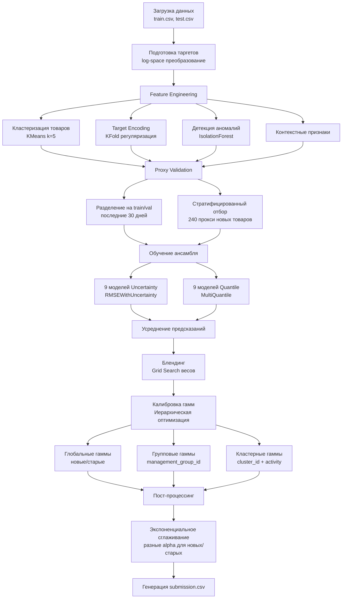

# Динамическое ценообразование в розничной торговле

Решение соревнования по предсказанию ценовых интервалов для товаров на основе исторических данных о продажах и контекстных признаков.

## 📋 Описание задачи

Необходимо предсказать нижнюю (`price_p05`) и верхнюю (`price_p95`) границы ценового диапазона для каждого товара на каждый день тестового периода. Оценка проводится по метрике **mean 1D Intersection over Union (IoU)** между истинными и предсказанными интервалами.

## 🏗️ Структура проекта

```
.
├── main.py                 # Основной файл с моделью и пайплайном
├── requirements.txt        # Зависимости проекта
├── notebooks/
│   ├── EDA.ipynb          # Интерактивный анализ данных
│   └── EDA.md             # Итоговый отчет по EDA
├── data/
│   ├── train.csv          # Обучающая выборка
│   ├── test.csv           # Тестовая выборка
│   └── sample_submission.csv
└── results/
    └── submission.csv      # Финальные предсказания
```

## 🔧 Основные компоненты решения

### Архитектура модели

Решение использует **ансамбль из 18 моделей CatBoost** (9 моделей × 2 типа):

1. **Модели неопределенности** (`RMSEWithUncertainty`) — предсказывают среднее и дисперсию распределения цен
2. **Квантильные модели** (`MultiQuantile`) — предсказывают квантили 0.05, 0.5, 0.95

### Пайплайн решения



### Ключевые особенности

#### 1. Генерация признаков (`feature_engineering`)

- **Кластеризация товаров** (KMeans, k=5) по агрегированным признакам: средняя цена, разброс цен, частота акций
- **Target Encoding** с KFold-регуляризацией для всех уровней иерархии категорий
- **Детекция аномалий** (IsolationForest) для выделения нестандартных товаров
- **Контекстные признаки**: относительный объем, взаимодействие активности и кластера

#### 2. Валидация (Proxy Validation)

Для оценки качества на трейне используется **proxy validation**, которая симулирует условия теста:
- Выделение последних 30 дней как валидационного периода
- Стратифицированный отбор 240 товаров из трейна как "прокси новых товаров" (по распределению `management_group_id` из теста)

#### 3. Блендинг и калибровка

- **Блендинг** предсказаний двух типов моделей с подбором весов через grid search
- **Калибровка гамм** (множителей для интервалов) с иерархией:
  - Глобальные гаммы для новых/старых товаров
  - Групповые гаммы по `management_group_id` (для новых)
  - Кластерные гаммы по `cluster_id` (для старых)
  - Специфичные гаммы по кластеру + активности

#### 4. Пост-процессинг

- **Экспоненциальное сглаживание** предсказаний по времени для каждого товара
- Разные параметры сглаживания для старых и новых товаров (подбираются через grid search)

### Параметры модели

Основные параметры настраиваются в классе `Config`:

- **Ансамбль**: 9 моделей с разными параметрами (depth, rsm, bootstrap_type, bagging_temperature, subsample)
- **Окно обучения**: последние 90 дней из трейна
- **Разнообразие ансамбля**: вариации глубины деревьев, sampling-параметров для повышения разнообразия предсказаний

## 📊 Анализ данных

Подробный анализ данных представлен в:
- **`notebooks/EDA.ipynb`** — интерактивный ноутбук с визуализациями и статистиками
- **`notebooks/EDA.md`** — итоговый отчет с ключевыми выводами

### Основные выводы из EDA и их использование в пайплайне

1. **Новые товары** (150 товаров, 23.6% от теста)
   - **Проблема**: товары без истории требуют особого подхода
   - **Решение в пайплайне**:
     - Proxy validation с симуляцией новых товаров через стратифицированный отбор по `management_group_id`
     - Отдельная калибровка гамм для новых товаров (глобальные → групповые по `management_group_id`)
     - Буст гамм для новых товаров (`new_gamma_boost=1.04`) для учета повышенной неопределенности
     - Разные параметры экспоненциального сглаживания для старых и новых товаров

2. **Временная зависимость** (автокорреляция lag-1: 0.67 для `price_p05`, 0.81 для ширины)
   - **Проблема**: цены сильно зависят от предыдущих значений
   - **Решение в пайплайне**:
     - Экспоненциальное сглаживание предсказаний по времени для каждого товара (`_apply_smoothing`)
     - Сортировка по `product_id` и `dt` перед применением EWM для корректной временной последовательности
     - Подбор оптимальных параметров сглаживания (`smoothing_alpha_old`, `smoothing_alpha_new`) через grid search

3. **Эффект акций** (`activity_flag=1` снижает цены на ~14%, увеличивает ширину на ~86%)
   - **Проблема**: акции существенно меняют поведение цен
   - **Решение в пайплайне**:
     - Использование `activity_flag` в кластеризации товаров (агрегация `activity_flag.mean()`)
     - Признак взаимодействия `act_x_clust = activity_flag * cluster_id`
     - Детальная калибровка гамм по комбинации кластера и активности (`clusters_act`)
     - Использование `activity_flag` в детекции аномалий

4. **Динамические категории** (категории меняются по датам для большинства товаров)
   - **Проблема**: категории не являются фиксированными характеристиками товара
   - **Решение в пайплайне**:
     - Target Encoding для всех уровней иерархии (`management_group_id`, `first_category_id`, `second_category_id`, `third_category_id`, `product_id`)
     - KFold-регуляризация при Target Encoding для предотвращения утечки данных
     - Байесовское сглаживание с глобальным средним для редких комбинаций

5. **Сдвиг распределений** (тест отличается по погодным признакам и календарным характеристикам)
   - **Проблема**: распределение признаков в тесте отличается от трейна
   - **Решение в пайплайне**:
     - Использование последних 90 дней из трейна (`train_window_days=90`) для обучения на более актуальных данных
     - Proxy validation с выделением последних 30 дней для симуляции временного сдвига
     - Стратификация прокси новых товаров по `management_group_id` для учета распределения в тесте
     - Иерархическая калибровка гамм для адаптации к разным группам товаров

## 🔍 Метрика оценки

**Mean 1D IoU** — среднее пересечение по объединению интервалов:

```
IoU = intersection / union
где:
  intersection = max(0, min(U_true, U_pred) - max(L_true, L_pred))
  union = w_true + w_pred - intersection
  w_true = U_true - L_true + ε
  w_pred = U_pred - L_pred + ε
```

Чем выше значение, тем лучше (максимум 1.0).

### Воспроизводимость

Все случайные процессы фиксируются системным сидом (`system_seed=322`). Для разнообразия ансамбля используются разные сиды, но они также фиксированы в конфигурации.

## 📈 Результаты

**Финальные результаты соревнования:**

- **Private Leaderboard**: **2-е место** с score **0.265574** (финальная оценка на 60% тестовых данных)
- **Public Leaderboard**: **3-е место** с score **0.272687** (оценка на 40% тестовых данных)

Решение показало стабильное качество на обоих лидербордах, что подтверждает корректность подхода к валидации и калибровке модели.
